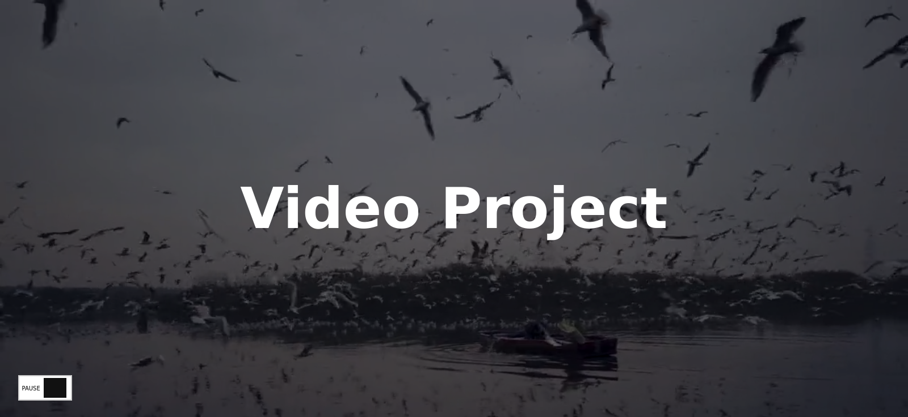

# Video Overlay Component

Overlay component with pause/play controls for a full screen video.

## Screenshot

## Installation

1. Clone the repository `git clone https://github.com/AlexdelCarmen/video-overlay-component`

## Features

- Play/Pause controls for the video.
- Overlay decorating the full screen video.

## Technologies

- HTML5
- CSS3
- JavaScript

## License

This source code is licensed under the Unlicense. See the [LICENSE](./LICENSE) file for details.

## Credits

- Inspired by John Smilga's [video](https://youtu.be/3PHXvlpOkf4) for freeCodeCamp.
- Coded by [Alejandro Borges](https://github.com/AlexdelCarmen)
